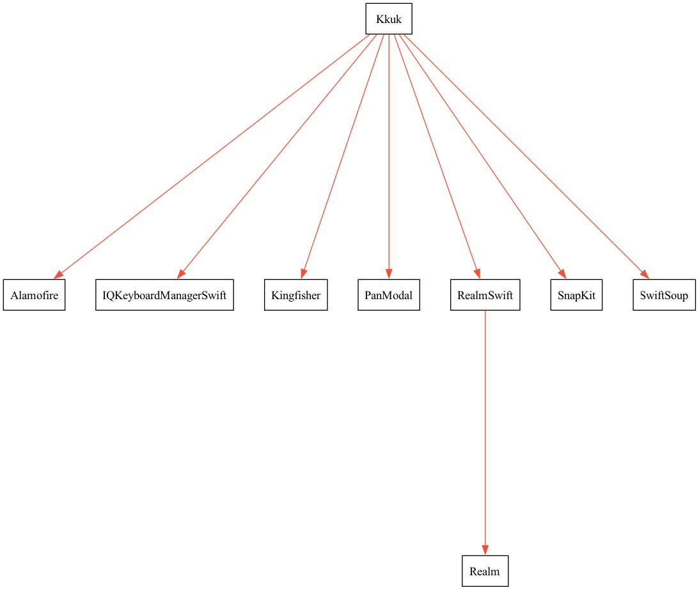

<div align="center"> 
  
[](https://apps.apple.com/kr/app/kkuk/id6471813268)

</div>

# kkuk-ios

     

## Overview

웹 브라우저의 북마크 또는 즐겨찾기 기능은 본인이 어떤 브라우저를 사용하고 있는지에 따라 활성화 정도에 차이가 있습니다. 그리고 원하는 콘텐츠를 찾는 것도 저장한 콘텐츠의 양이 많아질 수록 쉽지 않습니다.
이러한 문제점을 해결하기 위해 Kkuk 아카이빙 서비스는 링크, 이미지, 기타 데이터 정보를 카테고리로 분류하여 체계적으로 관리할 수 있도록 도와주는 도구입니다.

사용자는 필요에 따라 메모를 작성해서 콘텐츠를 추가할 수도 있고, 공유하는 것이 가능합니다. 검색 기능도 지원하기 때문에 특정 단어를 입력하거나 범위를 설정하여 보관 중인 콘텐츠를 쉽게 추적할 수 있습니다.


## Architecture


## Dependencies

<div align="center"><table><tr><td></td></tr></table></div>

| Target | Name |
|:-------|:-------|
| Interface &nbsp;&nbsp;&nbsp;&nbsp;&nbsp;&nbsp;&nbsp;&nbsp;&nbsp;&nbsp;&nbsp;&nbsp;&nbsp;&nbsp;&nbsp;&nbsp;&nbsp;&nbsp;&nbsp;&nbsp;&nbsp;&nbsp;&nbsp;&nbsp; | UIKit |
| Web View &nbsp;&nbsp;&nbsp;&nbsp;&nbsp;&nbsp;&nbsp;&nbsp;&nbsp;&nbsp;&nbsp;&nbsp;&nbsp;&nbsp;&nbsp;&nbsp;&nbsp;&nbsp;&nbsp;&nbsp;&nbsp;&nbsp;&nbsp;&nbsp; | WebKit |
| Persistent Data &nbsp;&nbsp;&nbsp;&nbsp;&nbsp;&nbsp;&nbsp;&nbsp;&nbsp;&nbsp;&nbsp;&nbsp;&nbsp;&nbsp;&nbsp;&nbsp;&nbsp;&nbsp;&nbsp;&nbsp;&nbsp;&nbsp;&nbsp;&nbsp; | RealmSwift |
| UI Constraints &nbsp;&nbsp;&nbsp;&nbsp;&nbsp;&nbsp;&nbsp;&nbsp;&nbsp;&nbsp;&nbsp;&nbsp;&nbsp;&nbsp;&nbsp;&nbsp;&nbsp;&nbsp;&nbsp;&nbsp;&nbsp;&nbsp;&nbsp;&nbsp; | SnapKit |
| HTTP Networking &nbsp;&nbsp;&nbsp;&nbsp;&nbsp;&nbsp;&nbsp;&nbsp;&nbsp;&nbsp;&nbsp;&nbsp;&nbsp;&nbsp;&nbsp;&nbsp;&nbsp;&nbsp;&nbsp;&nbsp;&nbsp;&nbsp;&nbsp;&nbsp; | Alamofire |
| HTML Parse &nbsp;&nbsp;&nbsp;&nbsp;&nbsp;&nbsp;&nbsp;&nbsp;&nbsp;&nbsp;&nbsp;&nbsp;&nbsp;&nbsp;&nbsp;&nbsp;&nbsp;&nbsp;&nbsp;&nbsp;&nbsp;&nbsp;&nbsp;&nbsp; | SwiftSoup |
| Image caching &nbsp;&nbsp;&nbsp;&nbsp;&nbsp;&nbsp;&nbsp;&nbsp;&nbsp;&nbsp;&nbsp;&nbsp;&nbsp;&nbsp;&nbsp;&nbsp;&nbsp;&nbsp;&nbsp;&nbsp;&nbsp;&nbsp;&nbsp;&nbsp; | Kingfisher |
| Code Style &nbsp;&nbsp;&nbsp;&nbsp;&nbsp;&nbsp;&nbsp;&nbsp;&nbsp;&nbsp;&nbsp;&nbsp;&nbsp;&nbsp;&nbsp;&nbsp;&nbsp;&nbsp;&nbsp;&nbsp;&nbsp;&nbsp;&nbsp;&nbsp; | SwiftLint |
| Keyboard covering &nbsp;&nbsp;&nbsp;&nbsp;&nbsp;&nbsp;&nbsp;&nbsp;&nbsp;&nbsp;&nbsp;&nbsp;&nbsp;&nbsp;&nbsp;&nbsp;&nbsp;&nbsp;&nbsp;&nbsp;&nbsp;&nbsp;&nbsp;&nbsp; | IQKeyboardManager |
| Bottom sheet &nbsp;&nbsp;&nbsp;&nbsp;&nbsp;&nbsp;&nbsp;&nbsp;&nbsp;&nbsp;&nbsp;&nbsp;&nbsp;&nbsp;&nbsp;&nbsp;&nbsp;&nbsp;&nbsp;&nbsp;&nbsp;&nbsp;&nbsp;&nbsp; | PanModal |

## Project structure

```
.
├── 📂Kkuk
│   ├── 📂Application
│   ├── 📂Domain
│   │   ├── 📂Entity
│   │   ├── 📂Helper
│   │   └── 📂Service
│   ├── 📂Global
│   │   ├── 📂Base
│   │   ├── 📂Component
│   │   ├── 📂Enum
│   │   ├── 📂Extension
│   │   ├── 📂Protocol
│   │   └── 📂Resource
│   │       ├── 📦Assets.xcassets
│   │       ├── 📂Font
│   │       ├── 📦Settings.bundle
│   │       ├── 📜Info.plist
│   │       └── 📜LaunchScreen.storyboard
│   ├── 📂Presentation
│   │   ├── 📂AddContent
│   │   ├── 📂Category
│   │   ├── 📂Content
│   │   ├── 📂Home
│   │   ├── 📂PanModal
│   │   ├── 📂SearchContent
│   │   ├── 📂Setting
│   │   └── 📂Web
│   └── 📜Kkuk.entitlements
└── 📂KkukShareExtension
    ├── 📂View
    ├── 📜Info.plist
    └── 📜KkukShareExtension.entitlements
```

### Contributors

| 김유진 <br> Yujin Kim | 이세령 <br> Seryeong Lee | 강주연 <br> Jooyeon Kang | 손영하 <br> Yeongha Son | 장가겸 <br> gagyeom Jang |
|:----:|:----:|:----:|:----:|:----:|
||||||
|[@yujinkim1](https://github.com/yujinkim1)|[@se-ryeong](https://github.com/se-ryeong)|[@jooYeonStudyiOS](https://github.com/jooYeonStudyiOS)|[@Sonyeongha](https://github.com/Sonyeongha)|[@rkrua](https://github.com/rkrua)|

### Contact us

[문의하기](mailto:kkuk.help@gmail.com)

### License

Kkuk 서비스는 MIT 라이선스를 준수합니다. 자세한 내용은 [LICENSE](/LICENSE)를 참조하세요.
